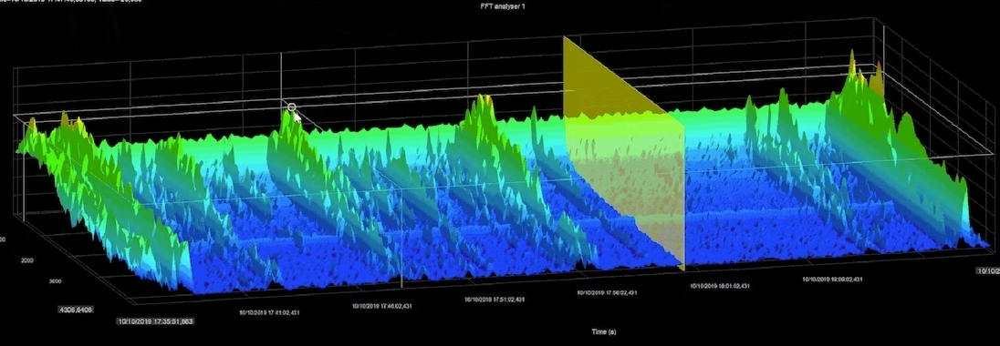

# **Realtime Signal Processing Project: Building an Autotune Software**


<br/>

<p align="center">
	
</p>
<p>&nbsp;</p>

## Presentation

In this project, we implemented a real-time C/C++ version of autotune from the source code **duplex.cpp** source code. We used the **rtaudio** library to facilitate the real-time processing.

## Architecture

```bash
|---BE_tstr_2023_v1
|---bin
|---doc
|---files
|---src
    |---tests
        |--- ...
        |--- tests
            |--- ...
            |---duplex
            |---duplex.cpp
            |---duplex.hpp
        |--- ...
    |---plot_figures.py
|---.gitignore
|---README.md
```

* The code project lives on the **duplex.cpp** file. You can figues after tests in the **files** folder. For more information about the project, you can read the documentation in the **doc** foler.
In the **somefunc.cpp** file you can find a set of functions designed to make
functions for easier implementation.


## Configuration

You can find a configuration part in the **duplex.cpp** file.

| Variable        | Comment |
| ------|-----|
| PATH_RECORD     	| Figures directory	|
| AUTOTUNE    	| True to activate the autotune processing	|
| DISPLAY    	| True to display logs for debuging	|
| bufferFrames    	| Buffer size for real-time processing	|
| bufferSize    	| Buffer size to record all the voice test	|
| ringBufferSize    	| Buffer size for averaging the fundamental frequency over several frame	|
| samplingFrequency    	| The number of sample during one seconde of record	|
| nbrDemiTons    	| The number of the number of demi tones we round off |
| nfftSize    	| Length of the fft |
| jumpedIdx   	| Number of indix to jump to avoid interferance during the research of the fundamental frequency  |


## How to use

- To run the code on MacOS (and Linux) it is not necessary to adapt the code you can just follow these next steps. For Windows users see bellow.

- It is recommended to use and **headphone** to avoid Larsen effect.

1. Clone the repository

```bash
git clone https://github.com/SimLrt32/autotune_project/tree/main/BE_tstr_2023_v1
```

2. Change your working directory

```bash
cd autotune-project
```

3. First compile all the project. To do so, enter these command lines. If needed install **autoconf** and **autotools-dev** with brew (macOS users only).

```bash
autoconf
./configure
make all
```

If you need to install **autoconf** and **autotools-dev**:

```bash
sudo apt-get install autotools-dev
sudo apt-get install autoconf
```

4. You can adapt the code in **duplex.cpp** file. Then compile and execute.

```bash
make all
./duplex [argument_1] [argument_2]
```
[argument_1]: Number of canal. 1 is okay.

[argument_2]: Sampling frequency. We worked with 48000.


5. Finally you can visualize your records with the **plot_figures.py** file. We assume you have already a python environement or something similar.

```bash
python plot_figures.py
```

You can also use the **Run and Debug** module from **Visual Studio Code** to run this file.

[For Windows users]

3. Install the [*gcc compilator*](https://github.com/jmeubank/tdm-gcc/releases/download/v10.3.0-tdm64-2/tdm64-gcc-10.3.0-2.exe)

4. Then you have to use an other version of **rtaudio**. It is the **6.0.1** which lives on the BE_tstr_2023_v1 folder. You need to unzip the **.tar**, and add our code in the new **duplex.cpp** file.
Move the **RtAudio.cpp** and **RtAudio.h** from **rtaudio-6.0.1** folder in the **rtaudio-6.0.1\test** folder.

5. Compile the project

```bash
C:\TDM-GCC-64\bin\g++ -Wall -D__WINDOWS_WASAPI__ -Iinclude -o duplex
duplex.cpp RtAudio.cpp -lole32 -lwinmm -lksuser -lmfplat -lmfuuid
-lwmcodecdspuuid
```

6. Execute the project with the **4** step in the previous part.

## Results

...

## References

[1] [*The RtAudio Home Page*](https://www.music.mcgill.ca/~gary/rtaudio/): RtAudio is a set of C++ classes that provide a common API (Application Programming Interface) for realtime audio input/output across Linux, Macintosh OS-X and Windows operating systems. It has been used for the implementation of our autotune.

[2] [*Thomas Hueber*](https://www.gipsa-lab.grenoble-inp.fr/~thomas.hueber/): Teacher for the project.

[3] [*Olivier Perrotin*](https://www.gipsa-lab.grenoble-inp.fr/~olivier.perrotin/cv_en.html): Teacher for the project.

[4] [*Auto-tune Presentation*](https://en.wikipedia.org/wiki/Auto-Tune)

## Authors
- [Brice Convers](https://briceconvers.com)
- [Simon Laurent]()

